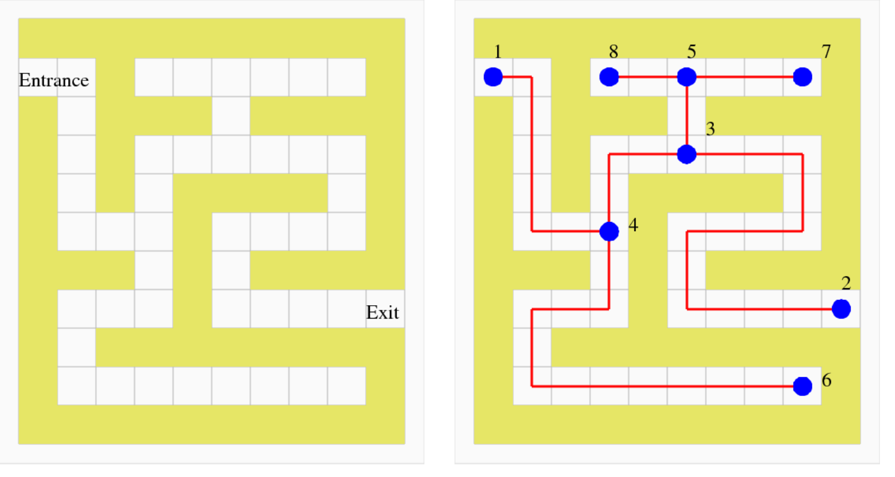

# FSU_ISC4221C_Fall23_Lab4
Graphs 1

## Objective
We want to practice the basic concects of graphs that we have seen on class. 

##  Problem 1 (20 Pts):  
A  maze  is an arrangement of rooms, connected in a complicated way. A maze might have an entrance 
 and exit, or we might be required to go from one room to another.  



A maze can be represented by a graph. The entrance, the exit, every dead-end, and every point where we  
have to make a choice should each be a node. The paths between these points become edges. The "right  
hand rule" suggests getting from one spot by walking with your right hand always touching the wall, turning  
whenever you have to to keep your hand on the wall.  

In Figure 1 the left panel is a simple maze and the center panel its corresponding graph.  

1. (5) Verify that the "right hand rule" works for the yellow maze, by **listing the sequence of nodes**, starting  
at node 1, that lead to node 2 following this rule. Add to your report. 
2. (5) Create an **edge list** for your graph and add to your report.   
3. (5) Create an **adjacency matrix**  for your graph add to your report.
4. (5) Plot your graph using **networkx** and add to your report.

##  Problem 2 (20 Pts):  

Write a function that can read a graph that is described by an edge list from a file. 
Your function should:
* Read the edge list of a graph;
* Print and return the edge list (list of lists or tuples);
* Print and return the number of edges (int).
* Print and return the number of nodes (int);
* Print and return the degree of each node (list of ints).

Append the output of your function in your report for the "Walther" graph. (walther_edges.txt)

The structure of your function should be:
    
```Python
def read_graph(filename):
    # Your code here
    return edge_list, n_edges, n_nodes, degrees
```

##  Problem 3 (20 Pts):  
Write a function based on the "Connection Algorithm" discussed in class to determine
 whether there is a path from one node to another in a graph:

* Read the edge list of a graph;
* Read the numeric indices of two nodes;
* Determine if there is a path from one node to the other and print “path" or “no path".

Append the output of your code on the “Paths" graph (path_edges.txt), and the following pairs of nodes:

* from node G (7) to node H (8)
* from node G (7) to node I (9)

The structure of your function should be:
```Python
def find_path(edges, node_a, node_b):
    # .....
    print("path")
    return True
    # .....
    print("no path")
    return False
```

<!-- 
## Problem 4 (30 Pts):
Write a program that uses the brute force approach to the traveling salesman problem, and prints out the length of the **shortest round trip**.

* read the edge list of a graph (the “tsp_edges.txt” file);
* read the edge weights of a graph (the “tsp_edge_weights.txt” file);
* check all possible itineraries;
* print and return the sequence of nodes in the shortest itinerary;
* print and return the total length of the shortest itinerary.

To check all possible itineraries, we need to generate them. You can use the permutations()
function from the “itertools” module. An example for generating permutations for the list [1, 2,
3] is given:

```Python
list(itertools.permutations([1,2,3]))
# [(1, 2, 3), (1, 3, 2), (2, 1, 3), (2, 3, 1), (3, 1, 2), (3, 2, 1)]
```

The structure of your function should be:
```Python
def find_shortest_path(edges, edges_weights):
    return shortest_path, shortest_path_length
```
>